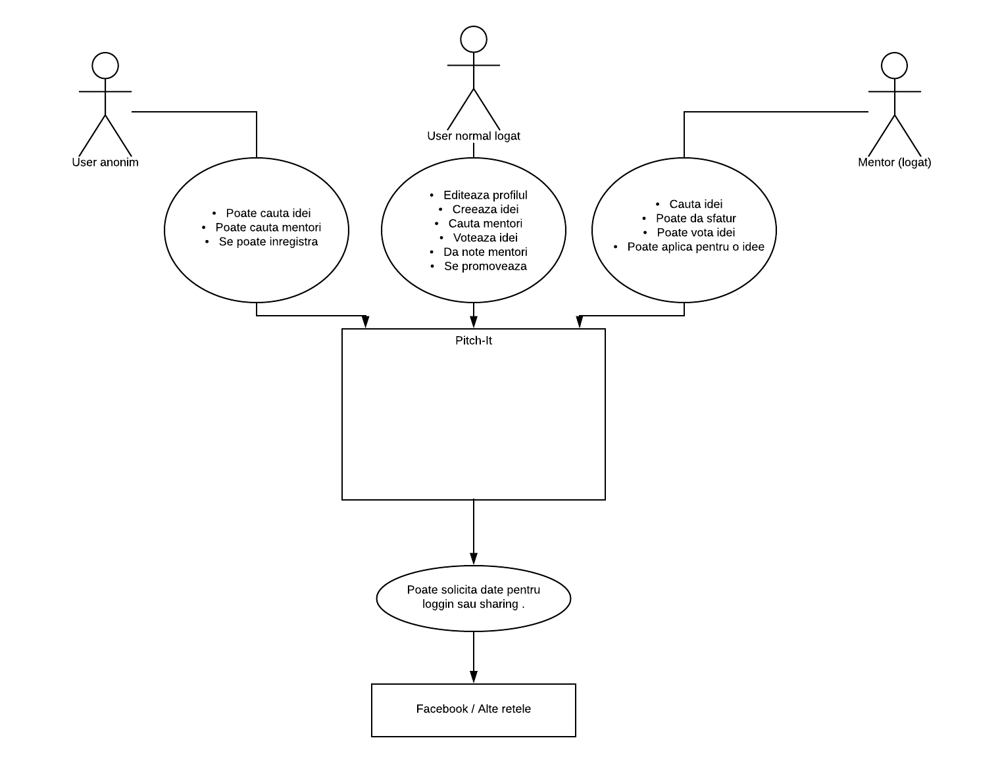
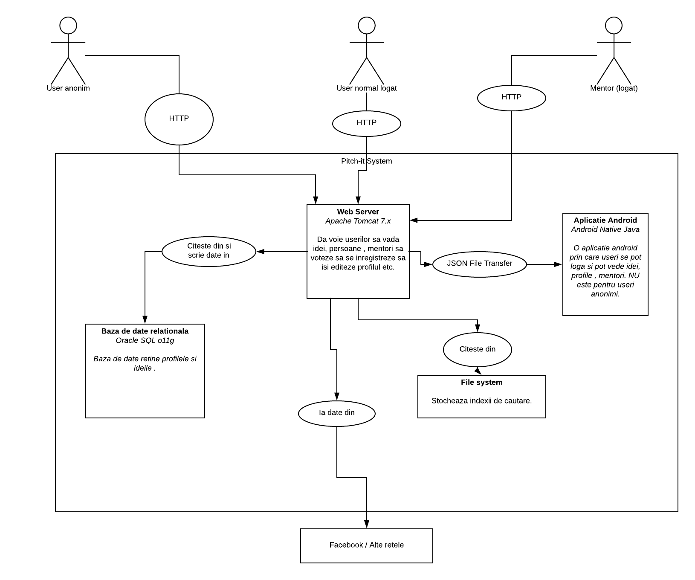

# Pitch

This project was generated with [Angular CLI](https://github.com/angular/angular-cli) version 1.7.4.

## Development server

Run `ng serve` for a dev server. Navigate to `http://localhost:4200/`. The app will automatically reload if you change any of the source files.

## Code scaffolding

Run `ng generate component component-name` to generate a new component. You can also use `ng generate directive|pipe|service|class|guard|interface|enum|module`.

## Build

Run `ng build` to build the project. The build artifacts will be stored in the `dist/` directory. Use the `-prod` flag for a production build.

## Running unit tests

Run `ng test` to execute the unit tests via [Karma](https://karma-runner.github.io).

## Running end-to-end tests

Run `ng e2e` to execute the end-to-end tests via [Protractor](http://www.protractortest.org/).

## Further help

To get more help on the Angular CLI use `ng help` or go check out the [Angular CLI README](https://github.com/angular/angular-cli/blob/master/README.md).

# Documentatie

## Background (Context)
O aplicatie prin care se pot propune idei, alte persoane le pot vedea si le pot sustine. De asemenea pot exista mentori care sa ajute la dezvoltarea ideii.
Site-ul greenpioneer.co furnizeaza o cale de a gasi persoane , grupuri si mentori legate de o anumita idee sau initiativa.
Pentru un sumar vizual vedeti Context diagram.

## Functionalitati
1.	Postarea ideilor.
2.	Cautarea ideilor.
3.	Promovarea ideilor. 
4.	Votarea ideilor.
5.	Crearea profilelor de mentori sau useri normali.
6.	Cautarea de mentori si idei.

## Context diagram (Zoom out)

## Scopul site-ului e sa:
1.	Consolideze si distribuie idei, ajuta la promovarea acestora in si inafara comunitatii.
2.	Incurajeaza o cultura deschisa, de colaborare si invatare in comunitatea locala sau globala.

## Useri
1.	Useri anonimi – care nu au cont. Toti de pe un browser.
2.	Autentificati – persoane care si-au facut un  cont , pot propune idei , pot vota idei si mentori, pot adera la numite idei.
3.	Mentori – sunt liderii unor proiecte , ofera sfaturi si indicatii. 

## Sisteme externe
1.	Facebook – userii se pot loga cu facebook.
2.	Gmail – userii se pot loga cu un cont de gmail.

## Functional overview
In centrul platformei PitchIt se afla persoanele, mentorii si ideile.
•	Persoanele – sunt oameni care au idei, sau care vor sa contribuie la rezolvarea unei anumite cauze.
•	Mentorii – sunt oameni cu experienta care pot oferi sfaturi pretioase oamenilor cu idei.
•	Idei – sunt din domenii variate, oamenii le pot vota iar ideile populare vor fi vazute de multi oameni si realizarea acestora devine foarte posibila.

## Continut (content)
•	Idei – prezentarea acestora .
•	Useri – prezentarea lor. 
Gaming Engine 
O functionalitate majora a sistemului Pitch-It este un simplu game engine pentru a incuraja persoanele sa fie implicate in proiecte . (Se ofera puncte  si insigne)

## Cerinte non-functionale
### Performanta
Incarcarea paginii nu trebuie sa dureze mai mult de 10s.
###Scalabilitate
Sistemul trebuie sa fie capabil sa se adapteze la potentialul mare de clienti.
Sistemul trebuie sa retina pana la 1000 de proiecte in prima faza.
###Disponibilitate
De vreme ce site-ul are un buget limitat nu sunt constrangeri de disponibilitate, totusi site-ul ar trebui sa fie activ cel putin 20h pe zi.
###Securitate
Desi majoritatea continutului poate fi vazut de useri anonimi platforma furnizeaza autentificare pentru a putea activa functionalitatile de editare si votare.
Toate autentificarile se for face via third-party lib (Facebook , Gmail).
Ideile vor fi publice in prima faza. Siteul nu isi asuma responsabilitatea pentru eventualele furturi intelectuale.
###Internationalizare si localizare
Toate interfetele cu userii vor fi in romana sau engleza.
###Compatibilitate browser
Siteul va rula pe urmatoarele browsere : Firefox, Chrome , Internet Explorer 8 (an dup), Safari.
###Data
Datele nu vor fi pastrate odata stere. 
Capacitatea maxima de stocare este de 1000 proiecte.

##Constrangeri
###Buget 
De vreme ce nu exista un buget formal exista constrangere de a folosi deoar tehnologii open-source. Ideal site-ul ar trebui sa ruleze pe un server cu un pret de host mai mic de 100 Ron pe luna.
###Principii 
Pentru a oferi o mapare simpla a arhitecturii in cod , structura de package-uri ale codului reflecta o convenctie „Package by compenent” in defavoarea unei convenctii package by layer.  (De exemplu in aplicatia android serviciile de extragere a fisierelor JSON vor fi puse intru-un package impreuna desi sunt pe layere diferite).

##Arhitectura software
###Containare 
Diagrama urmatoare furnizeaza containerele logice care constitue Pitch-It system. 

